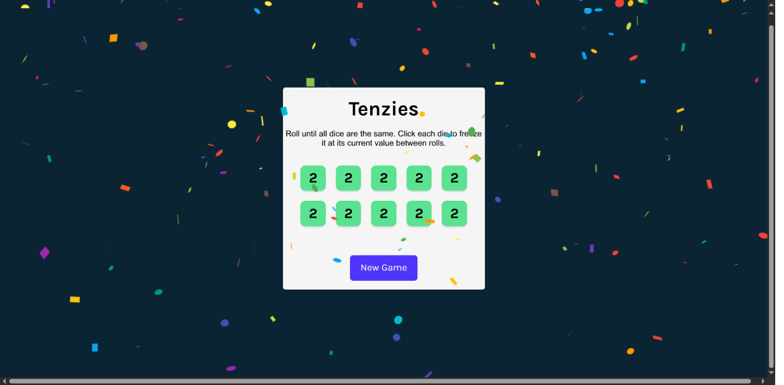

# 🎲 Tenzies Game

[](https://github.com/yourusername/tenzies-game)
[](LICENSE)
[](https://reactjs.org/)
[](https://vitejs.dev/)

## 📖 Descripción Breve

Tenzies es un emocionante juego de dados recreado en React, donde el objetivo es lograr que todos los dados muestren el mismo número. Esta aplicación web interactiva permite a los usuarios "congelar" dados seleccionados mientras ruedan los demás, creando una experiencia de juego estratégica y adictiva.

## ✨ Características Principales

- 🎯 **Juego Interactivo**: 10 dados virtuales con mecánica de "hold" intuitiva
- 🎉 **Efectos Visuales**: Animación de confetti al ganar para celebrar victorias
- ♿ **Accesibilidad**: Soporte completo para lectores de pantalla y navegación por teclado
- 📱 **Responsive**: Diseño adaptable que funciona en dispositivos móviles y desktop
- ⚡ **Rendimiento**: Construido con Vite para carga rápida y desarrollo eficiente
- 🔄 **Reinicio Fácil**: Botón "New Game" para comenzar partidas inmediatamente

## 🖼️ Demo/Vistas Previas



*Vista previa del juego Tenzies mostrando los 10 dados y la interfaz de usuario*

Para una experiencia interactiva, puedes ejecutar el proyecto localmente o visitar una demo la [demo en vivo](https://seb-rm.github.io/Seb-RM/React-Vite-Tenzies/).

## 🛠️ Tecnologías Utilizadas

| Tecnología | Versión | Propósito |
|------------|---------|-----------|
|  | 19.1.1 | Framework principal para componentes UI |
|  | 7.1.7 | Herramienta de build y desarrollo rápido |
|  | 19.1.1 | Renderizado de componentes en el DOM |
|  | 5.1.6 | Generación de IDs únicos para dados |
|  | 6.4.0 | Efectos de celebración animados |
|  | 9.36.0 | Linting y calidad de código |
|  | 3 | Estilos y diseño responsivo |

## 🚀 Instalación y Configuración

### Prerrequisitos

- Node.js (versión 16 o superior)
- npm o yarn

### Instalación

```bash
# Clona el repositorio
git clone https://github.com/Seb-RM/React-Vite-Tenzies.git
cd Seb-RM/React-Vite-Tenzies

# Instala dependencias
npm install

# Inicia el servidor de desarrollo
npm run dev
```

### Configuración de Producción

```bash
# Construye para producción
npm run build

# Vista previa de la build
npm run preview
```

### Variables de Entorno

No se requieren variables de entorno para este proyecto. Todas las configuraciones están hardcodeadas para simplicidad.

## 📚 Guía de Uso

### Juego Básico

1. **Inicio**: Al cargar la página, verás 10 dados con valores aleatorios
2. **Tirar Dados**: Haz clic en "Roll" para generar nuevos valores
3. **Congelar Dados**: Haz clic en un dado para "congelarlo" y mantener su valor
4. **Objetivo**: Consigue que todos los dados congelados muestren el mismo número
5. **Victoria**: Cuando ganes, aparecerá confetti y el botón cambiará a "New Game"

### Controles

- **Botón "Roll"**: Genera nuevos valores para dados no congelados
- **Clic en Dado**: Alterna entre congelado (verde) y no congelado (blanco)
- **Botón "New Game"**: Reinicia el juego con dados nuevos

### Configuración Avanzada

El juego no tiene configuraciones avanzadas. Para modificaciones, edita los archivos fuente directamente.

## ⚙️ Explicación Técnica (DETALLADA)

### 📁 index.html

- **Propósito**: Punto de entrada HTML que estructura la aplicación web
- **Conceptos Clave**: Estructura semántica HTML5, meta tags para responsividad, integración de fuentes Google Fonts
- **Fragmentos Destacados**:

```html
<!doctype html>
<html lang="en">
  <head>
    <meta charset="UTF-8" />
    <meta name="viewport" content="width=device-width, initial-scale=1.0" />
    <title>Tenzies</title>
    <link rel="preconnect" href="https://fonts.googleapis.com">
    <link href="https://fonts.googleapis.com/css2?family=Karla:ital,wght@0,200..800;1,200..800&display=swap" rel="stylesheet">
  </head>
  <body>
    <div id="root"></div>
    <script type="module" src="/src/main.jsx"></script>
  </body>
</html>
```

- **Flujo de Datos**: El archivo carga el script principal que inicia React
- **API/DOM**: Define el contenedor `#root` donde React monta la aplicación

### 📁 src/main.jsx

- **Propósito**: Archivo de entrada que inicializa la aplicación React
- **Conceptos Clave**: Renderizado de raíz con createRoot, importación de estilos globales
- **Fragmentos Destacados**:

```jsx
import { createRoot } from 'react-dom/client'
import './index.css'
import App from './App.jsx'

createRoot(document.getElementById('root')).render(
  <App />
)
```

- **Flujo de Datos**: Importa y renderiza el componente principal App
- **API/DOM**: Utiliza ReactDOM para montar en el elemento con id 'root'

### 📁 src/index.css

- **Propósito**: Estilos globales que definen la apariencia visual del juego
- **Conceptos Clave**: CSS Grid para layout de dados, Flexbox para centrado, diseño responsivo
- **Fragmentos Destacados**:

```css
.dice-container {
  display: grid;
  grid-template: auto auto / repeat(5, 1fr);
  gap: 20px;
  margin-bottom: 40px;
}

button.roll-dice {
  height: 50px;
  white-space: nowrap;
  width: auto;
  padding: 6px 21px;
  border: none;
  border-radius: 6px;
  background-color: #5035FF;
  color: white;
  font-size: 1.2rem;
}
```

- **Flujo de Datos**: Aplica estilos a componentes renderizados por React
- **API/DOM**: Define clases CSS que se aplican dinámicamente vía className en JSX

### 📁 src/App.jsx

- **Propósito**: Componente principal que maneja la lógica del juego y estado global
- **Conceptos Clave**: useState para gestión de estado, useEffect para efectos secundarios, useRef para referencias DOM
- **Fragmentos Destacados**:

```jsx
const [dice, setDice] = useState(() => generateAllNewDice());
const buttonRef = useRef(null);

const gameWon =
  dice.every((die) => die.isHeld) &&
  dice.every((die) => die.value === dice[0].value);

useEffect(() => {
  if (gameWon) {
    buttonRef.current.focus();
  }
}, [gameWon]);
```

- **Flujo de Datos**: Estado `dice` → renderizado de componentes Die → eventos onClick → actualización de estado
- **API/DOM**: Maneja eventos de clic, actualiza DOM vía estado, enfoca elementos con refs

### 📁 src/assets/components/Die.jsx

- **Propósito**: Componente reutilizable que representa un dado individual
- **Conceptos Clave**: Props para comunicación padre-hijo, estilos inline condicionales
- **Fragmentos Destacados**:

```jsx
const styles = {
  backgroundColor: props.isHeld ? "#59E391" : "white",
};

return (
  <button
    style={styles}
    onClick={props.hold}
    aria-pressed={props.isHeld}
    aria-label={`Die with value ${props.value}, 
    ${props.isHeld ? "held" : "not held"}`}>
    {props.value}
  </button>
);
```

- **Flujo de Datos**: Recibe props del padre → renderiza UI → emite eventos onClick al padre
- **API/DOM**: Maneja eventos de clic, actualiza estilos dinámicamente, soporta accesibilidad con ARIA

## 🎯 Arquitectura

### Estructura del Proyecto

```text
Seb-RM/React-Vite-Tenzies/
├── public/
│   └── index.html          # Template HTML
├── src/
│   ├── assets/
│   │   ├── components/
│   │   │   └── Die.jsx     # Componente de dado individual
│   │   └── images/         # Recursos estáticos
│   ├── App.jsx             # Componente principal del juego
│   ├── index.css           # Estilos globales
│   └── main.jsx            # Punto de entrada React
├── package.json            # Dependencias y scripts
└── vite.config.js          # Configuración de Vite
```

### Patrones de Diseño Implementados

- **Componente Funcional**: Uso de funciones en lugar de clases para componentes
- **Estado Local**: Gestión de estado en el componente raíz con propagación hacia abajo
- **Props Drilling**: Paso de funciones y datos a través de props
- **Render Props**: Componentes hijos reciben funciones del padre para actualizar estado
- **Efectos Secundarios**: useEffect para manejar lógica no relacionada con renderizado

### Flujo de Datos General

1. **Inicialización**: generateAllNewDice() crea array de objetos dado
2. **Interacción Usuario**: Clics en dados → hold() actualiza estado isHeld
3. **Roll**: rollDice() regenera valores para dados no held
4. **Victoria**: Condición gameWon dispara confetti y cambia UI
5. **Reinicio**: Nuevo array de dados resetea el juego
